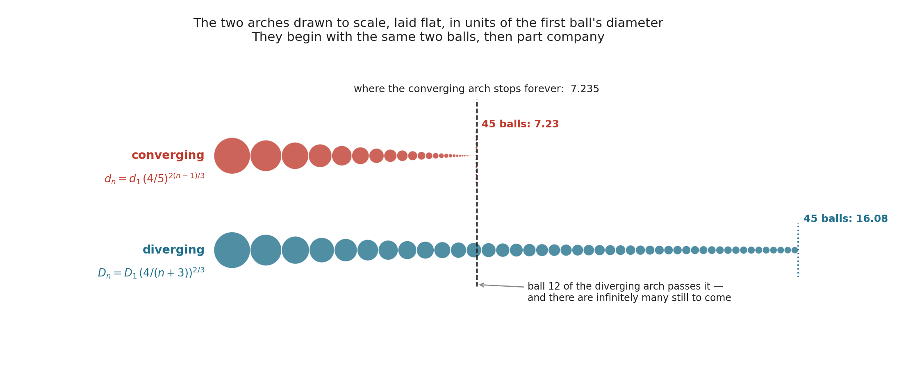

# Ball Arches

**Math:** [[Infinite Series and Convergence]]
**Craft:** Temari — traditional Japanese embroidered thread balls
**Official page:** https://mathemalchemy.org/2022/01/11/math-connections-in-the-ball-arches/

## What it is
Two arches of thread-wrapped balls rise above the garden. One reaches upward, one plunges
into the bay, and the difference between them is the whole of what a mathematician means
by **convergence**.

On both arches the balls shrink, and on both they shrink toward nothing. But the upward
arch has a top. Add together the diameters of all its balls — infinitely many of them —
and the total is a finite height the arch never exceeds. The arch diving into the bay has
no such ceiling. Its balls shrink too, only slightly more slowly, and that slight
difference is enough: given room, it would go on forever.

Which means you cannot tell the two apart by looking at any one ball. Shrinking to nothing
is not enough to make an infinite sum finite. That is the surprise, and it is why there
are two arches here instead of one.

What hangs in the gallery is the **visible portion** of each series — over 120 woven balls
between the two arches. The rest is left to the imagination, which is the only place the
infinitely small ones could go.

**Both arches are built from balls shrinking toward nothing, yet only one of them has a
top. What is different about the way they shrink?**

## Why the diving arch never stops
The arch that plunges into the bay is close kin to the most famous divergent sum in
mathematics, the **harmonic series**:

    1 + 1/2 + 1/3 + 1/4 + 1/5 + ⋯

Every term is smaller than the last and they head toward zero, yet the running total has
no ceiling at all. Pass any number you like — a hundred, a million — and the sum will
eventually go by it, though it takes its time about it.

The arch's balls shrink *more slowly* than those fractions do. Line the two up so the
first ball and the first fraction are the same size, and from there every ball is the
larger of the pair — so the arch's running total stays ahead of the harmonic series the
whole way. If that sum has no ceiling, this one certainly cannot.

The two do drift apart in speed, though, and dramatically. To reach a length of fifty
first-ball diameters the arch needs about 535 balls; the harmonic series needs roughly
940,000 terms to reach the same total. Both are infinite in the end. Being infinite says
nothing at all about being quick.

## The embroidered balls
Of the 120-odd balls, **exactly 22 are embroidered — the ones at [twin-prime](https://en.wikipedia.org/wiki/Twin_prime)
indices** — in the Japanese **[temari](https://en.wikipedia.org/wiki/Temari_(toy))** folk
art. The choice ties the arches to the primes theme in the garden below —
[[The Garden and Reef]], where the squirrels run a prime sieve → [[Prime Numbers]]. It
also solved a practical problem: embroidering all of them was neither feasible nor
desirable, and the twin primes give a manageable count and a pleasingly irregular
spacing.

## Key vocabulary
- **Convergent series** — an infinite sum whose running total approaches a specific finite
  value → [[Infinite Series and Convergence]].
- **Divergent series** — an infinite sum whose running total has no ceiling, even when the
  individual terms shrink toward zero.
- **Harmonic series** — the sum of 1, 1/2, 1/3, 1/4, … The standard example of a divergent
  series whose terms go to zero → [[Infinite Series and Convergence]].
- **[Temari](https://en.wikipedia.org/wiki/Temari_(toy))** — the Japanese embroidery art
  rendering each term of the sequence as a physical object.

## Cross-links
Same core math as [[Tess the Tortoise]] (Zeno's ½ + ¼ + ⅛ + … = 1), rendered in a
different craft — a natural pairing.

This is the most directly teachable scene in the installation for a **Calculus 2** course,
where convergence and divergence of series is a standard unit →
[[Docent Program/Curriculum/index|Curriculum Connections]].

## Additional Notes
**Local connections:** Samantha Pezzimenti (creator; also a creator on [[Knotical (Knotilus Bay)]])

